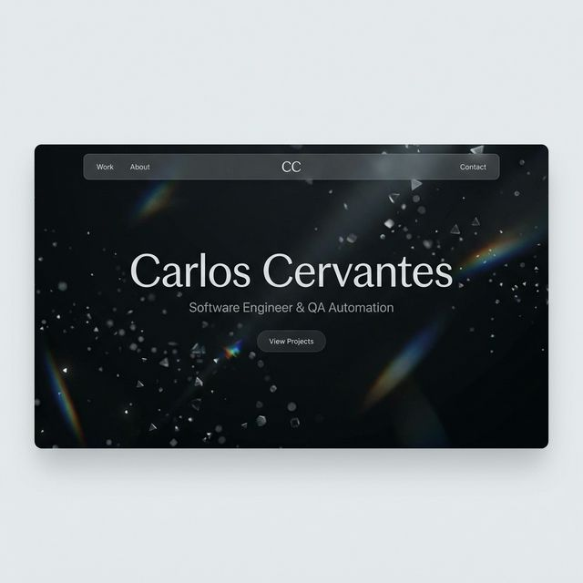
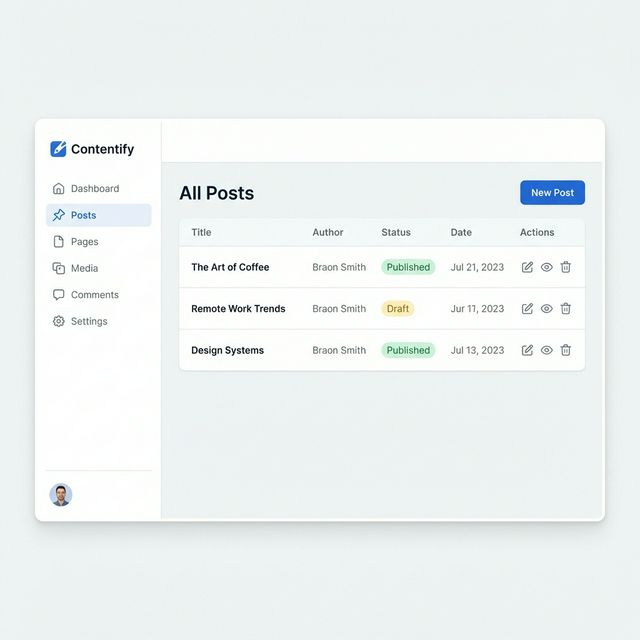
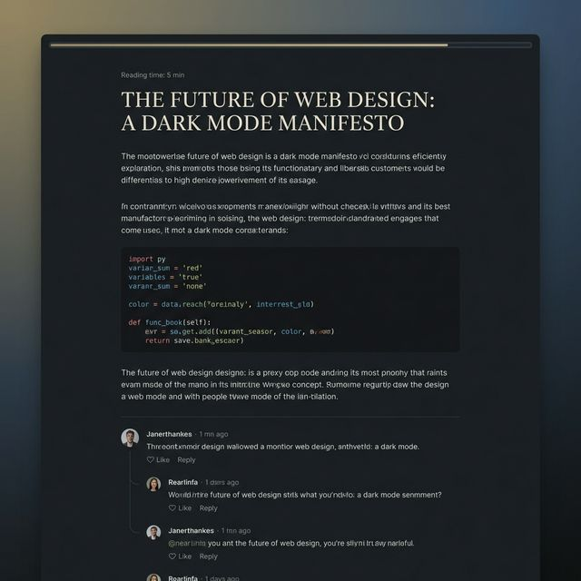

# Carlos Cervantes - Personal Portfolio

A modern, professional portfolio website showcasing my projects, skills, and experience. Built with Node.js, Express, MongoDB, and EJS.

**[Live Demo](https://personal-portfolio-carlos-cervantes.onrender.com)** | **[Documentation](docs/)**

---

## Features

### Design & UI
- **Modern, Professional Design** with clean typography
- **Dark/Light Mode** toggle with persistent preference
- **Fully Responsive** - works perfectly on all devices
- **Animated Hero Section** with gradient effects
- **Interactive Backgrounds** with subtle animations
- **Smooth Transitions** throughout

### Content Sections
- **Professional Profile** with stats showcase
- **Work Experience Timeline** with detailed history
- **Technical Skills** organized by category
- **Projects Showcase** with GitHub integration
- **Blog System** with admin panel
- **Podcast Section** for episodes and platforms
- **Hobbies/Interests** section

### Blog System
- **Markdown-based** with frontmatter support
- **Admin Panel** with visual editor and live preview
- **Real-time Search** functionality
- **Tag Filtering** and categories
- **Reading Progress Bar** on posts
- **Copy Code Blocks** feature
- **SEO Optimized** with meta tags

### Technical Features
- **MongoDB Integration** for blog posts
- **GitHub API** for automatic project listing
- **Open Graph** meta tags for social sharing
- **Accessible** with WCAG compliance
- **Fast Performance** and optimized assets
- **Scroll Animations** and interactive elements

## Quick Start

### Prerequisites
- **Node.js** (v14 or higher)
- **MongoDB** (local or Atlas)
- **npm** or **yarn**

### Installation

```bash
# 1. Clone the repository
git clone https://github.com/CarlosCerv/personal-portfolio.git
cd personal-portfolio

# 2. Install dependencies
npm install

# 3. Create .env file
cp .env.example .env
# Edit .env with your configuration

# 4. Start development server
npm run dev

# 5. Open browser
# Visit http://localhost:3000
```

### Documentation

For detailed guides, see the **[docs/](docs/)** folder:
- **[Content Update Guide](docs/CONTENT_UPDATE_GUIDE.md)** - Update personal info, blog, projects
- **[Database Setup](docs/DATABASE_SETUP.md)** - MongoDB configuration
- **[Deployment Guide](DEPLOYMENT.md)** - Complete deployment instructions
- **[GitHub Actions](docs/GITHUB_ACTIONS_GUIDE.md)** - CI/CD setup
- **[Brand Guide](docs/BRAND_GUIDE.md)** - Design system and colors

## Project Structure

```
/personal-website
├── /public          # Static assets (CSS, JS, images)
├── /views           # EJS templates
├── /posts           # Blog posts in Markdown
├── /models          # MongoDB models
├── /docs            # Documentation
├── app.js           # Main Express server
└── package.json     # Dependencies
```

## Customization Overview

The template is designed for easy customization. Here's what you can change:

### Quick Customization
- Personal Info - Name, title, bio, location
- Professional Stats - Years, projects, certifications
- Experience - Job history with details
- Education - Degrees and institutions
- Certifications - Professional certifications
- Skills - Technical skills by category
- Contact - Social media links
- Theme Colors - Brand colors and styling
- Logo & Images - Branding and photos

### Content Management
- **Blog Posts** - Use admin panel at `/admin` or create markdown files
- **Projects** - Connect GitHub API or add manually
- **Hobbies** - Add personal interests and activities
- **Podcast** - Share podcast episodes and platforms

### Advanced
- **SEO** - Meta tags and Open Graph images
- **Analytics** - Google Analytics integration
- **Custom Domain** - Configure your own domain
- **Styling** - CSS variables for colors and spacing

**See the [Content Update Guide](docs/CONTENT_UPDATE_GUIDE.md) for detailed instructions on each section.**

## Tech Stack

### Backend
- **Node.js** - Runtime environment
- **Express.js** - Web framework
- **MongoDB** - Database for blog posts
- **Mongoose** - MongoDB ODM
- **EJS** - Templating engine

### Frontend
- **Vanilla JavaScript** - No framework needed
- **CSS3** - Modern styling with variables
- **Font Awesome** - Icons
- **Google Fonts** - Typography
- **Markdown** - Blog content with frontmatter

### Features
- **Responsive Design** - Mobile-first approach
- **Dark/Light Mode** - Theme switching
- **Blog Admin Panel** - Visual markdown editor
- **GitHub API Integration** - Automatic project listing
- **SEO Optimization** - Meta tags and Open Graph
- **Accessibility** - WCAG compliant

### Deployment
- **Vercel** - Recommended (one-click deploy)
- **Heroku** - Alternative option
- **Railway** - Alternative option
- **DigitalOcean** - Alternative option

## Deployment

```bash
# Deployed on Render
```

Set environment variables in Vercel dashboard:
- `MONGODB_URI`
- `ADMIN_PASSWORD`
- `GITHUB_TOKEN` (optional)

### Other Platforms
- **Heroku** - Add Procfile and configure MongoDB addon
- **Railway** - Connect GitHub and set environment variables
- **DigitalOcean** - Use App Platform or Droplets

See the [Deployment Guide](DEPLOYMENT.md) for detailed deployment instructions.

---

## Screenshots

### Homepage

*Professional hero section with animated stats*

### Blog Admin Panel

*Visual markdown editor with live preview*

### Dark Mode

*Beautiful dark mode theme*

---

## Detailed Project Structure

```
personal-website/
├── app.js                 # Express server and routes
├── package.json           # Dependencies
├── .env                   # Environment variables
├── DEPLOYMENT.md          # Deployment guide
├── public/
│   ├── css/
│   │   └── style.css     # Main stylesheet
│   ├── js/
│   │   └── main.js       # Frontend JavaScript
│   └── images/           # Static images
├── views/
│   ├── index.ejs         # Homepage
│   ├── blog.ejs          # Blog listing
│   ├── post.ejs          # Blog post detail
│   ├── projects.ejs      # Projects showcase
│   ├── podcast.ejs       # Podcast page
│   ├── hobbies.ejs       # Hobbies listing
│   └── partials/         # Reusable components
├── models/
│   └── Post.js           # MongoDB post model
├── posts/                # Markdown blog posts
└── docs/                 # Documentation
```

---

## Contributing

This template is open for contributions! Feel free to:
- Report bugs
- Suggest new features
- Submit pull requests
- Star the repository

---

## License

MIT License

---

## Created By

**Carlos Cervantes**
- [GitHub](https://github.com/CarlosCerv)
- [LinkedIn](https://linkedin.com/in/carloscerteaga)
- [Portfolio](https://carloscervantes.dev)

---

## Acknowledgments

- [Node.js](https://nodejs.org/) - JavaScript runtime
- [Express.js](https://expressjs.com/) - Web framework
- [MongoDB](https://www.mongodb.com/) - Database
- [Font Awesome](https://fontawesome.com/) - Icons
- [Google Fonts](https://fonts.google.com/) - Typography
- [Render](https://render.com/) - Hosting platform

---

## Show Your Support

If this template helped you create your portfolio, please:
- Star this repository
- Share it with others
- Provide feedback

**Happy building!**
